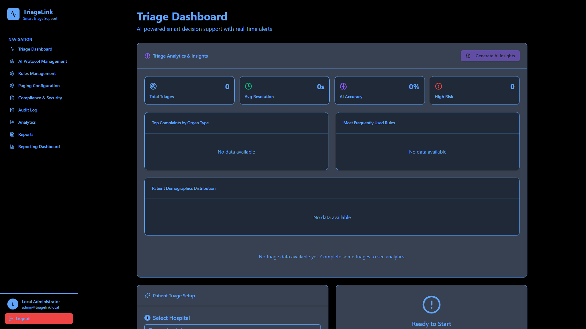
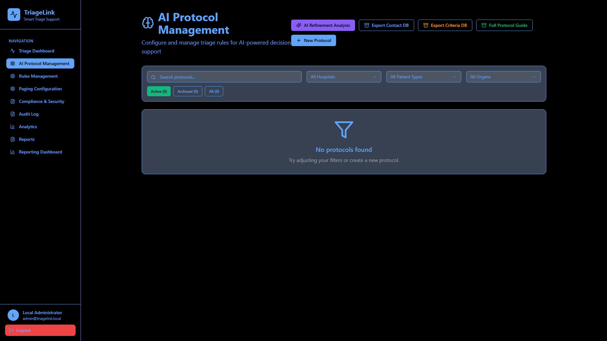
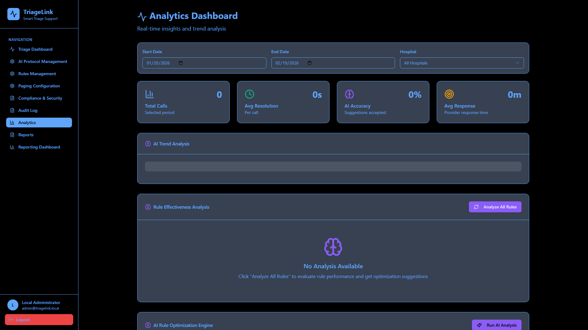
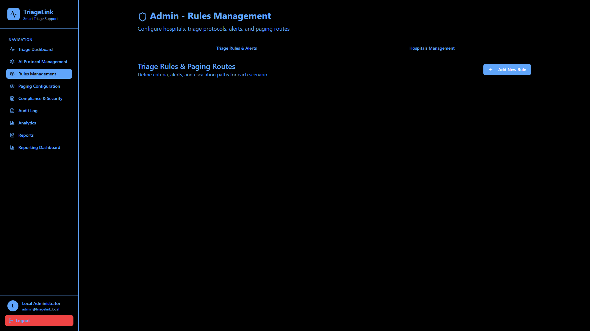
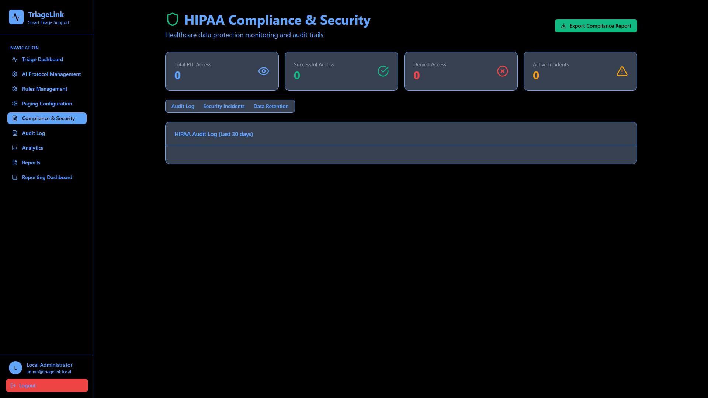
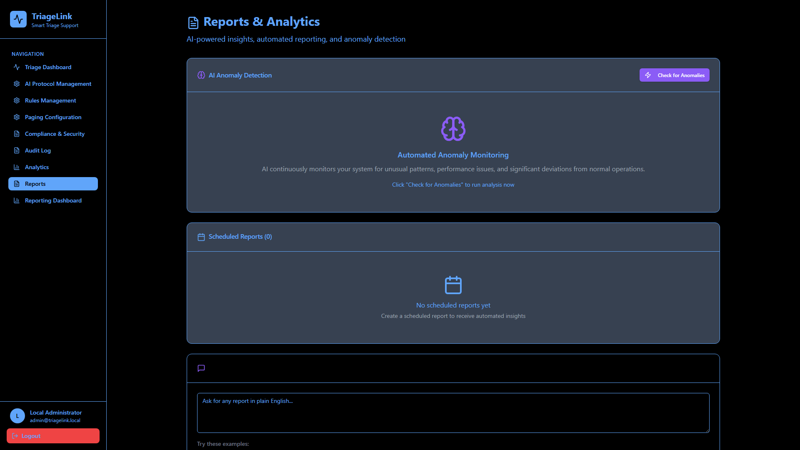

<p align="center">
  
</p>

<h1 align="center">TriageLink</h1>

<p align="center">
  <strong>Offline-first, AI-powered medical triage support system</strong>
</p>

<p align="center">
  <a href="https://github.com/NeuroKoder3/Triage-Link/actions/workflows/build.yml">
    
  </a>
  <a href="https://github.com/NeuroKoder3/Triage-Link/blob/main/LICENSE">
    
  </a>
  <a href="https://github.com/NeuroKoder3/Triage-Link/releases">
    
  </a>
  
  
  
</p>

<p align="center">
  <em>Cross-platform Electron desktop application for healthcare triage teams.<br/>
  No cloud. No external APIs required. Your data stays on your machine.</em>
</p>

---

> **This is an actively developed, ongoing project.**
> Features, UI, and APIs are evolving. Contributions, feedback, and bug reports are welcome!
> See [CONTRIBUTING.md](CONTRIBUTING.md) to get involved.

---

## Screenshots

### Triage Dashboard
Real-time smart decision support with AI-generated insights, patient demographics, and triage analytics at a glance.



### AI Protocol Management
Configure and manage AI-powered triage rules. Run refinement analysis, export contact and criteria databases, and create new protocols with intelligent filtering.



### Analytics Dashboard
Deep-dive into triage performance with trend analysis, rule effectiveness scoring, and an AI rule optimization engine.



### Rules Management
Define triage rules, alerts, escalation paths, and paging routes per hospital. Full CRUD with hospital management.



### HIPAA Compliance & Security
Monitor PHI access, track security incidents, manage data retention policies, and export compliance reports — all with full audit trails.



### Reports & Analytics
AI-powered anomaly detection, scheduled automated reports, and a natural language report generator — ask for any report in plain English.



---

## Features

| Category | Capabilities |
|----------|-------------|
| **Triage Dashboard** | Real-time patient triage, AI-assisted analysis, risk scoring, vitals tracking, session collaboration |
| **AI Protocol Management** | LLM-powered rule refinement, protocol creation, criteria filtering, contact DB export |
| **Rules Management** | Triage rules & paging routes, hospital management, rule CRUD with priority/severity |
| **Paging Configuration** | Alert escalation workflows, paging schedules, configurable notification chains |
| **Compliance & Security** | HIPAA audit logs, security incident tracking, data retention policies, compliance reports |
| **Analytics** | Trend insights, rule effectiveness analysis, AI rule optimization, risk assessment panels |
| **Reports** | Anomaly detection, scheduled reports, natural language report generation, AI suggestions |
| **Role-Based Access** | User management, custom roles & permissions, permission audit logging |
| **AI Integration** | Configurable LLM endpoint (Ollama, OpenAI, any compatible API), offline fallback |
| **Offline-First** | 100% local data persistence, zero cloud dependencies, works without internet |

---

## Quick Start

### Prerequisites

- **Node.js** 18+ (recommended: 20 LTS)
- **npm** 9+

### Install & Run

```bash
# Clone the repository
git clone https://github.com/NeuroKoder3/Triage-Link.git
cd Triage-Link

# Install dependencies
npm ci

# Run in browser (development)
npm run dev

# Run as Electron desktop app (development)
npm run electron:dev
```

The browser version opens at **http://localhost:5173/**. The Electron version launches a native desktop window.

---

## Production Build & Distribution

```bash
# Build renderer + package Electron app
npm run electron:build

# Platform-specific builds
npm run electron:build:win    # Windows (NSIS installer + ZIP)
npm run electron:build:mac    # macOS (DMG + ZIP)
npm run electron:build:linux  # Linux (AppImage + DEB)
```

Installers are output to the **`release/`** directory.

---

## AI / LLM Configuration

TriageLink works **fully offline by default**. To unlock AI-powered analysis, connect a local or remote LLM:

### Option A: Local LLM (Ollama)

```bash
# Install Ollama and pull a model
ollama pull llama3
```

Then configure in TriageLink:
```js
localStorage.setItem('triagelink_llm_endpoint', 'http://localhost:11434/v1/chat/completions');
localStorage.setItem('triagelink_llm_model', 'llama3');
```

### Option B: OpenAI-Compatible API

```js
localStorage.setItem('triagelink_llm_endpoint', 'https://api.openai.com/v1/chat/completions');
localStorage.setItem('triagelink_llm_api_key', 'sk-...');
localStorage.setItem('triagelink_llm_model', 'gpt-4');
```

---

## Data Storage

All data is stored locally in the Electron renderer's `localStorage`. Entity data is keyed under `triagelink_entity_<EntityName>`. No data ever leaves your machine unless you explicitly configure an external LLM endpoint.

---

## Tech Stack

| Layer | Technology |
|-------|-----------|
| **Desktop Shell** | Electron 33 |
| **Frontend** | React 18, React Router 7 |
| **Build** | Vite 6 |
| **Styling** | TailwindCSS 3, shadcn/ui (Radix UI primitives) |
| **State** | TanStack React Query 5 |
| **Charts** | Recharts |
| **Packaging** | electron-builder 25 |
| **CI/CD** | GitHub Actions |

---

## Project Structure

```
Triage-Link/
├── electron/                 # Electron main process
│   ├── main.js               #   App lifecycle, window creation, IPC
│   └── preload.cjs           #   Secure contextBridge API
├── src/
│   ├── api/
│   │   ├── appClient.js      #   Local data layer (entities, auth, integrations)
│   │   ├── entities.js        #   Entity exports
│   │   └── integrations.js    #   Integration exports (LLM, email, SMS, etc.)
│   ├── components/
│   │   ├── admin/             #   User/role management, audit log viewer
│   │   ├── alerts/            #   Live alerts panel
│   │   ├── analytics/         #   AI metrics, rule optimizer, risk assessment
│   │   ├── reports/           #   Anomaly detection, scheduled reports, AI suggestions
│   │   ├── triage/            #   Triage flow, collaboration, vitals, AI analysis
│   │   └── ui/                #   shadcn/ui component library
│   ├── hooks/                 #   Custom React hooks
│   ├── lib/                   #   Auth context, utilities, routing
│   ├── pages/                 #   Page-level views
│   └── App.jsx                #   Root component
├── assets/                    #   App icons for packaging
├── docs/screenshots/          #   Application screenshots
├── .github/workflows/         #   CI/CD pipeline
├── electron-builder.json      #   Packaging configuration
├── SECURITY.md                #   Security policy
├── CONTRIBUTING.md            #   Contribution guidelines
├── CODE_OF_CONDUCT.md         #   Community code of conduct
├── LICENSE                    #   MIT License
└── package.json
```

---

## Scripts Reference

| Command | Description |
|---------|-------------|
| `npm run dev` | Start Vite dev server (browser at localhost:5173) |
| `npm run build` | Build production renderer to `dist/` |
| `npm run electron:dev` | Launch Electron + Vite in development mode |
| `npm run electron:build` | Full Electron production build to `release/` |
| `npm run electron:build:win` | Windows build (NSIS + ZIP) |
| `npm run electron:build:mac` | macOS build (DMG + ZIP) |
| `npm run electron:build:linux` | Linux build (AppImage + DEB) |
| `npm run lint` | Run ESLint |
| `npm test` | Run test suite |

---

## Security

TriageLink implements defense-in-depth for Electron:

- **Context Isolation** — Renderer cannot access Node.js APIs
- **Sandbox Mode** — Renderer runs in a restricted sandbox
- **No Node Integration** — `nodeIntegration: false` in all windows
- **Content Security Policy** — CSP restricts script/resource origins
- **Preload Script** — Only explicitly exposed APIs via `contextBridge`
- **HIPAA Audit Logging** — All sensitive operations logged

See [SECURITY.md](SECURITY.md) for our vulnerability disclosure policy.

---

## Roadmap

This is an **ongoing project**. Planned improvements include:

- [ ] SQLite/IndexedDB backend for production-grade persistence
- [ ] Settings UI for LLM endpoint configuration (no console needed)
- [ ] Data import/export (JSON, CSV)
- [ ] Multi-user support with proper authentication
- [ ] Auto-update via electron-updater
- [ ] Internationalization (i18n)
- [ ] Comprehensive test suite (Jest + Playwright)
- [ ] Dark/light theme toggle
- [ ] PDF report export with branding

---

## Contributing

We welcome contributions! Please read [CONTRIBUTING.md](CONTRIBUTING.md) for guidelines on how to get started.

## Code of Conduct

This project follows the [Contributor Covenant Code of Conduct](CODE_OF_CONDUCT.md).

## License

[MIT](LICENSE) — free for personal and commercial use.

---

<p align="center">
  <sub>Built with care for healthcare teams by <a href="https://github.com/NeuroKoder3">NeuroKoder3</a></sub>
</p>
